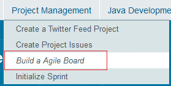

# Workshop Web Log File Analysis
A programmatic example of reading, parsing, scoring batch loads of spreadsheets from website activity using Java, Apache POI libraries with a json output.

# Overview

During the week of 8-7-17 we opened the stats for our Cloud Native workshop and noticed our External Session count in the
log file was ~29K. At first glance we were very excited for the numbers but were asked us to look into the logs in
more detail. Specifically we needed to develop a way to parse out BOT traffic, develop a scoring model on the data and collect calculate details about the confirmed human website traffic. The production system sat in our DMZ and this direct access to the database was not possible. Our only access to the logs was through a web export in a legacy .xls format that limited row counts to 64K. I leveraged the Apache POI libraries to access the .xls data and then did all parsing, cleansing and command line display with java.util & java.io libraries.  

## Code Overview Video
Please watch this video to get a feel for the problem and programmatic solution.

[Code Overview Video](https://youtu.be/pifJRY4vHss)

## Solution Factory Logging ---- Interactive Websites User Click Sequence Example
Here is a look at the sequence of events that create logs for the application.  

#### User Step 1 
A user navigates to https://launch.oracle.com/?cloudnative . The page appears but no other clicks are made. This is what
the user would see:

#### User Step 2 
On the backend the log file would look like this.

####User Step 3
Next the user, clicks the right arrow to see the next step in the flow.

####User Step 4
The log would document the click and the architecture frame that was viewed.

#### User Step 5 
Next the user select the Build Agile Board Step from the dropdown menu. A new architecture frame would appear.

#### User Step 6
The log would capture the architecture frame view.

#### User Step 7 
Last but not least the user presses the right arrow on his/her keyboard. A new architecture frame would appear.

